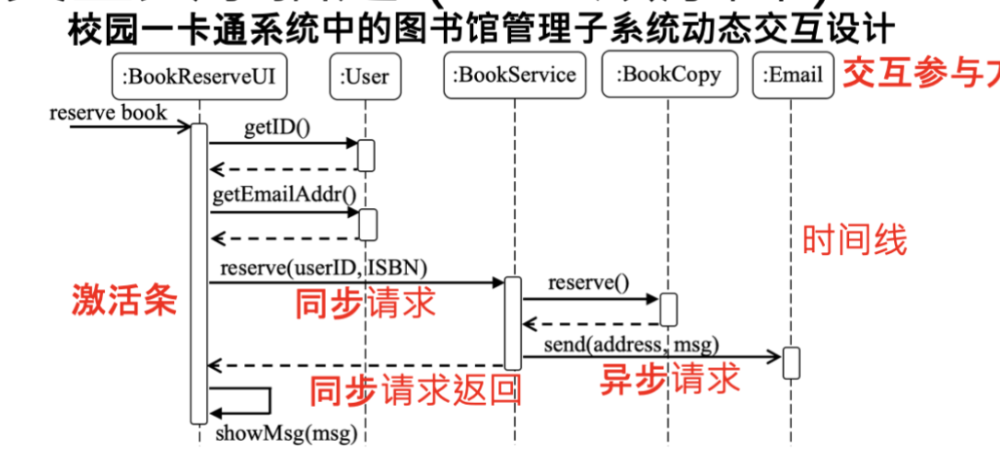

## 选择 15x2

涉及到的知识点：
- 软件工程的三大阶段
- 内聚程度排序
- 耦合子概念辨析
- 单元驱动测试根据**需求分析**阶段的文档编写用例
- 分布式体系结构中的CAP原则
- 辨析几类软件配置管理
- 接口的目的是共性抽象

## 判断 10

涉及到的知识点：
- 敏捷开发的核心思想
- CMM
- 金丝雀发布
- 软件根据功能的分类
- oop八股，高内聚低耦合
- “只有差软件才需要维护”（这个不太确定，因为我在很多套例题里做过）

## 名词解释 6x5（？）
>我印象里绝对只有这四个，但是不知道为什么写着6x5，如果缺少的话，希望后来人补充

黑盒白盒测试

用户故事和需求用例

集成测试中的自顶向下和自下而上

版本管理中的集中式和分布式

## 大题 3x10

简述体系结构描述视图中的4+1

根据一个uml顺序图，描述类和交互

黑盒测试，一个yyyy-mm的输入，有效输入是(1980年1月-2049年12)，根据等价类设计用例