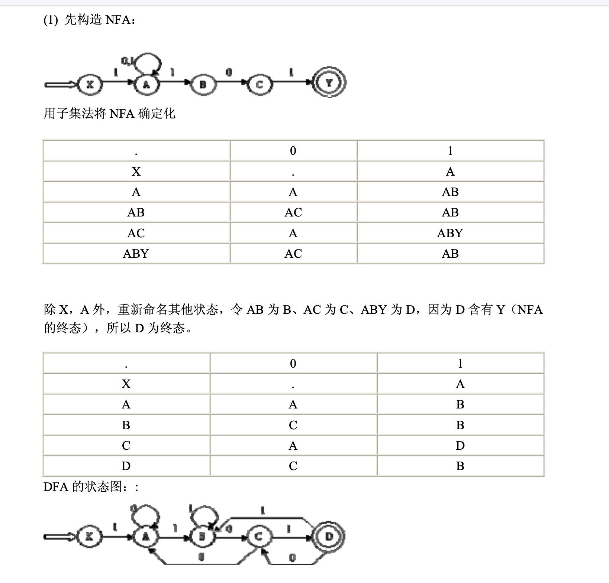
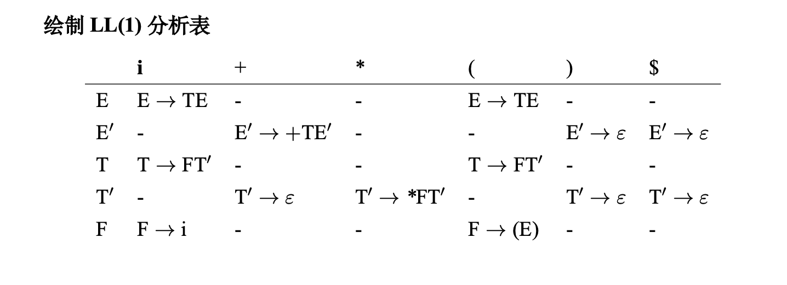
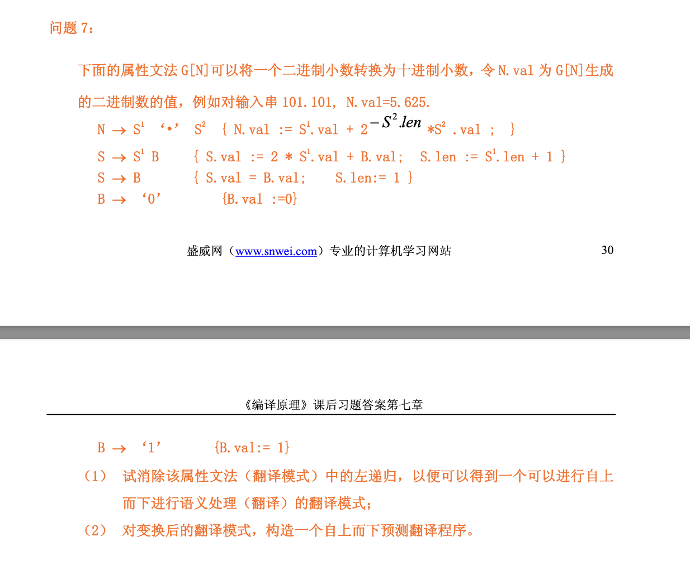

> 都是清华编译原理的课后题

## 词法分析
`1(0|1) *101`
- 正则转换NFA
- NFA确定化



## 自顶向下分析


- 绘制LL(1)表格
- 分析`i+i*i`串的过程中stack的变化



## 自底向上分析


- 绘制 SLR
- LR(1)第一个项集

## 语义分析

```
S->...
A->a
```

语义分析代码填空

没找到类似的，但是和下面这个题很像🤔，清华大学编译原理习题解 pdf page103-104之间的第二小问



## 中间代码优化-1

【一个有10+句子和循环的插图，看起来像是一个课程ppt的截图，但是我能力有限找不到了】

活性分析，写出每个句子的out


## 中间代码优化-2


## 水题 (8')
谈谈编译原理学习的感悟和理解

