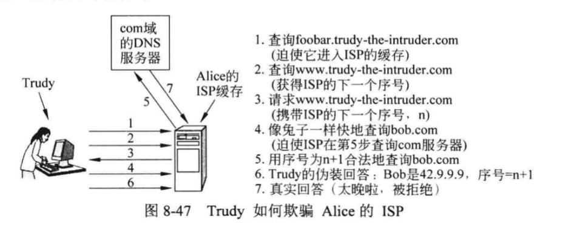

# 选择题

"样卷"原题或者改数；今年增加了一个令牌桶选择题，考察如图所示

# 判断

全错，是样卷上的

- CSMA/CD协议的二元指数回退算法本质上就是按2的幂次选择重试间隔，直至占有信道
- 底层无连接，能否向上提供有链接
- 一个用户向一个远程数据库发出一些事务请求。远程传输实体先将TPDU传递给上一层，然后确认。一旦接收到这个确认则可认为此项工作确实已经完成了
- TCP握手是否会建立两个链接
    
- 中继器、集线器、网桥、交换机、路由器和网关都是网络层互联设备

# 计算

## 1

假设采用时钟驱动方案来生成初始序号,该方案用到了一个 15 位的时钟计数器。每隔100毫秒时钟滴答一次,最大数据包生存期为60秒。试问,每隔多久需要重新同步一次? 

(a)在最差情况下。

(b)当数据每分钟用掉360个序号的时候。

## 2

CIDR计算

## 3

CSR计算，当帧为1101011011，生成多项式为x^4+x+1时，相应的CRC为?

## 4

2000hz信道，8种电平，信噪比30db，分别用奈奎斯特定理和香农定理计算上限

# 问答

## 逆转树

画以N为中心的逆转路径转发树，分析一下这种做法

## 隧道

什么是隧道技术，举例并解释

## qos

什么是qos，举例3种保证qos的做法

## timer

下面的时序图是可变滑动窗口协议的一种可能工作方式，为什么第2条消息的ack=15？buff=4意味着哪几个数据包能被发送？消息16存在的死锁问题如何解决？

## socket编程

怎么用socket编程实现tcp/udp链接？

# 大题

## osi

简述osi七层模型及其实现的功能

## DNS 攻击

如果没有理解错的话，似乎是DNS欺骗，然后让你分析这个攻击，这个攻击的细节见自顶向下方法第五版p660

